# Library workflow, 2026-10-02

How tones move between the pedal, the library and TonePush: the library as a
pane under the editor, a click that plays what it points at, drag and drop
between every place a tone can be, a device marker on every row, one set of
right-click menus, and a view of what you have published. It follows
Carmine's feedback on the redesign as built
(`../redesign-2026-10-01/implemented/README.md`) and is a proposal: no Rust
code has changed.

- `source/*.html` are the mockups. They load the redesign's kit from
  `../redesign-2026-10-01/source/assets` (`app.css`, `kit.js`, `data.js`,
  `icons.js`, the font) so they match what was built, and add what this
  proposal needs in `source/assets`: `lib.css` and `lib.js` (the library pane,
  the device marker, the audition bar, drag and drop, menus with keys),
  `data-lib.js` (synthetic tones, TonePush tones, uploads, setlists) and
  `icons-extra.js` (nine more Lucide icons).
- The PNGs beside this file are those mockups rendered as
  `<scene>-<width>x<height>-<theme>.png`: the main screen at 1024 × 640,
  1280 × 760 and 2560 × 1440 in both themes, the rest at 1280 × 760 (two
  also at 1024 × 640), three reference sheets at 1600 × 1000.
  `source/render.mjs` made them; see [Rendering](#rendering).
- All content is synthetic. Tone, song, artist, setlist and creator names are
  invented; HX model names and knob names are HX Edit's catalog's; the
  StompStation PRO's chain is the 2.x router as the editor draws it.

## What is wrong

Carmine's feedback, checked against the code:

1. **The library is a page.** To browse tones you leave the preset you are
   playing (`Page::Library` in `shell.rs`), so what you browse is never what
   you hear, and the editor is one switch away from where your eyes are.
2. **The page switch is on the wrong side.** Edit · Library · Pedal sits in
   the sidebar, under the device card, and changes everything to its right.
   The sidebar otherwise lists things (the pedal, its presets); this one
   control switches modes.
3. **A click on a library tone does nothing on the pedal.** The library has no
   audition at all: a click selects the row, a double click opens a preview
   that does not play (`open_tone`), and the only way to hear a tone is to
   write it into a slot. The Cloud has an audition, behind "Audition on the
   pedal" in the inspector, and switching away from the Cloud tab ends it
   (`show_library_view`).
4. **Nothing drags.** Sending a tone is the pedal mark on its row, or "Send to
   a slot" in the inspector, then a row in the sidebar. That last click writes
   the pedal's memory with no question (`finish_sending`).
5. **Only one family is marked.** `family_tag` shows "PRO" beside a
   StompStation tone when an HX is connected and "HX" when a PRO is, and
   nothing otherwise; no row ever says which HX. The library does not record
   the pedal a tone was kept from, although compatibility is per model (an HX
   Effects preset does not load on an HX Stomp; an XL reads Stomp presets), and
   publishing an HX tone with no pedal connected labels it "HX Stomp" whatever
   it was made on (`start_publishing`).
6. **Right-click is uneven.** Library rows have one item, Delete; Cloud rows
   have no menu; setlists and the pedal's presets have their own; no menu
   shows a key, and few keys exist.
7. **What you published is invisible.** Cloud is the public feed. There is no
   view of your own uploads, and the API has nothing to list, rename, hide or
   delete them with, nor setlists at all (see [TonePush's
   API](#tonepushs-api-what-it-does-and-what-needs-the-server)).
8. **Re-publishing an Original orphans a Song.** The editor always publishes
   with a new Song (`PublishSong::New`); for an Original the server creates a
   Song every time, and revising the Tone by its series key moves it into the
   new Song, leaving the old one empty on the server.
9. **Auditions from the Cloud count as downloads.** Every artifact request
   increments the Tone's `installs_count`, including the editor fetching it to
   play. Click to audition, and the arrow keys, would multiply that.

What is good stays: the set-aside audition in the worker (the edit buffer and
its undo history kept byte for byte until Put back or Keep), the model
browser's Put back and Keep, the picking mode that turns the sidebar into
destinations, the content-addressed library with versions, the rollback guard
and the read-only rule on unverified StompStation firmware, and every
confirmation that names what it writes.

## Principles

- **Every click on a sound plays it.** A tone in the library, on TonePush, in
  a setlist's slot, an older version: one click and the pedal plays it. A
  click never writes the pedal's memory. Right-click selects without playing.
- **One window, three places.** The pedal's presets on the left, what is
  playing above, what could play below. Moving a tone between them is a drag,
  and each place is always in view.
- **Controls sit next to what they control.** The library's tabs are in the
  library's own header. The pedal's pages open from the pedal, the device card
  at the top of the sidebar, and their tabs are in their page's head. The
  editor's lenses stay in the block's head.
- **Hearing is free; keeping names its destination; writing names what it
  replaces.** Put back and Keep are the only two ways out of an audition. Keep
  says the slot. A write to the pedal's memory asks once and says what it
  replaces and that the backup keeps it.
- **Unsaved work is set aside, never lost.** The first audition puts the
  loaded preset aside with its unsaved changes and undo history; every
  audition after it plays against that same baseline.
- **Every row says which pedal it is for**, family and model, in the same
  place, whether or not it is the pedal connected.
- **A drag is a shortcut.** Every drop has a menu item and a key.
- **Nothing is offered that TonePush cannot do.** Actions that need server
  work are left out until the server has them, not shown greyed out.

## The frame

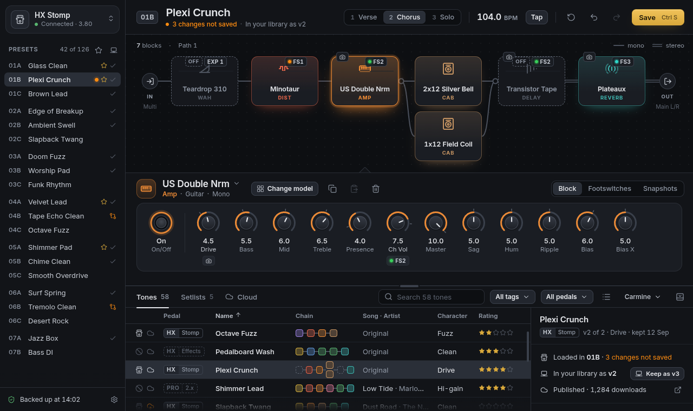

Also [1024 × 640](01-main-1024x640-dark.png) and
[2560 × 1440](01-main-2560x1440-dark.png), and in the light theme at
[1024 × 640](01-main-1024x640-light.png),
[1280 × 760](01-main-1280x760-light.png) and
[2560 × 1440](01-main-2560x1440-light.png).

**Sidebar.** The Edit · Library · Pedal switch is gone; the presets gain its
36 points. From the top: the device card, the presets in the pedal's banks,
the foot with the protection state. The device card is the pedal: a click
shows the pedal's own pages where the editor is, and its chevron opens a menu
of those pages and "Let the pedal go" (21, 22). The foot's "Backed up at
14:02" opens Backups. The sidebar no longer switches modes: what you click in
it is what the right side shows, the pedal itself or one of its presets.

**Editor.** Deck, board and block pane as built. The floor (the footswitch
strip) shows when the block pane keeps a full face under it; with the library
open at 1280 × 760 or smaller it gives way, and the tiles' hanging tags still
say what each switch drives.

**Library pane.** Under the editor, the full width of the main column.

- A splitter on its top edge, with a 34-point grip in the middle, resizes it;
  double-clicking the grip or Ctrl L folds it to its 40-point header, whose
  tabs still take drops. Its height and whether it is folded are kept in the
  settings file per window size.
- Defaults: 186 points at 1024 × 640, 232 at 1280 × 760, 512 at 2560 × 1440;
  at least the header and three rows when open.
- **What gives way.** The pane never takes height from the board: the chain
  is what tells you what is playing. It takes it from the block pane, in this
  order: the knobs step down from 68 to 44 points; they fold into one row
  that scrolls sideways and drops the control chips under each knob; then the
  face folds away and the block's head stays, with its name and its lens
  switch (18). Dragged up to the board, the pane is the old Library page with
  the chain still in view; dragging it down brings everything back.
- **Header**, from the left: the tabs **Tones**, **Setlists** and **Cloud**
  with their counts; on Cloud, a switch between **Everyone** and **Mine**;
  then the search for the open tab, the tag filter (or the order, on Cloud),
  the pedal scope, the columns menu, the account, and the fold button. At
  1024 points the filter, scope, columns and account share one menu.
- **Body**: the table and the inspector beside it (280, 300 or 400 points
  wide, resizable as built). At 1024 points the inspector opens over the table
  from its button. With nothing chosen, the inspector shows the loaded preset's
  tone: where it is, its versions, "Keep as v3" when it has unsaved changes.
  This is the "In your library" card the large layout had.
- **Rows.** A click plays (hover never does). The place marks keep their
  clicks as built: the pedal mark is "Put in a slot…", the cloud mark
  publishes or opens the tone on TonePush.

**Colour.** An audition wears the model browser's look as built: the
amber-tinted bar, the tinted row, the speaker in place of the pedal mark, and
a 2-point amber rule on the board's top edge. Amber stays the colour of what
to do next (Keep, the drop target, free slots while dragging); hot stays
unsaved changes; a reason a click cannot play is info blue, never danger.

**The pedal's pages** (Backups, impulse responses, favourite blocks, global
EQ, settings and activity on an HX; backups, NAM amps, NAM drives, impulse
responses, settings and firmware on a PRO) take the editor's place, under the
one-line deck as built, whose "Edit" becomes "Back to the preset" (Esc). The
library pane stays below, folded unless you open it. During a firmware update
the pane folds itself and says that auditions wait for the update.

## The screens

### 01 · The library under the editor

The HX Stomp with 01B Plexi Crunch loaded and three unsaved changes; the
library on Tones, all pedals, scrolled to the loaded preset's tone, which the
inspector shows. The Pedal column is new: every row says HX Stomp, HX Effects,
PRO 2.x or PRO 1.5, and a tone the connected pedal cannot play has a dashed
marker and a ban mark in place of the pedal mark. At 1024 × 640 the knobs
fold into one row and the Pedal column keeps the family; at 2560 × 1440 the
block, the footswitches and the snapshot matrix sit above a 512-point library
with the inspector's full details.

### 02, 03 · A click plays a library tone

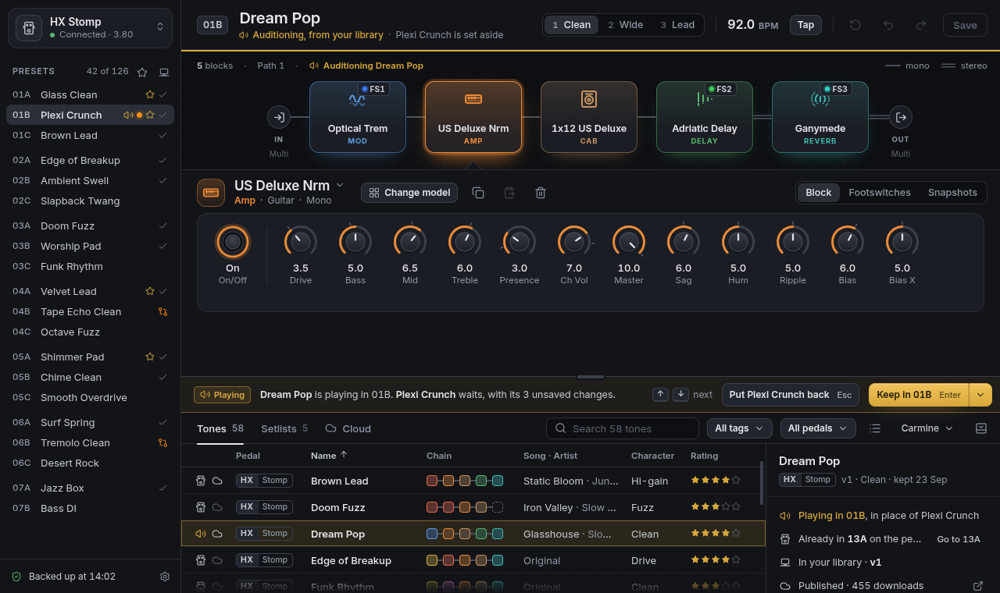

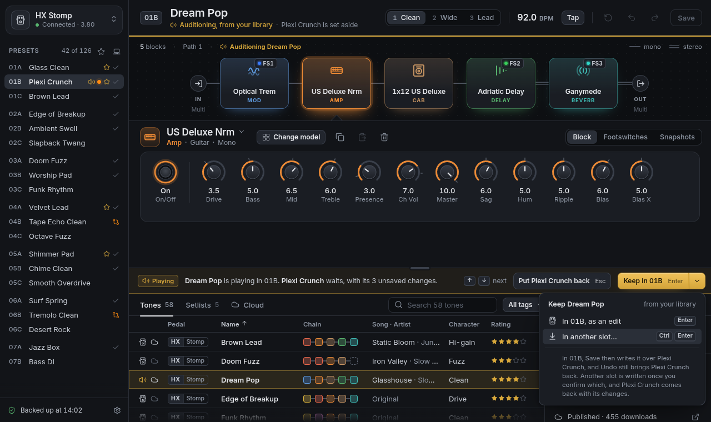

Also [1024 × 640](02-audition-library-1024x640-dark.png).

One click on Dream Pop. The pedal plays it in 01B's edit buffer, and four
places say so:

- **The audition bar**, on the pane's top edge, between what plays and the
  list you clicked: "Dream Pop is playing in 01B. Plexi Crunch waits, with its
  3 unsaved changes.", the arrow keys, **Put Plexi Crunch back** (Esc) and
  **Keep in 01B** (Enter) with its choices.
- **The deck**: Dream Pop, "Auditioning, from your library · Plexi Crunch is
  set aside". Save is off: what is playing is not 01B's preset until it is
  kept. Undo and redo start empty: the preset's history is set aside with it.
- **The board**: Dream Pop's chain, a 2-point accent rule on the board's top
  edge, and "Auditioning Dream Pop" in its header.
- **The row** is tinted and its pedal mark is a speaker; the sidebar's 01B
  wears the same speaker beside its unsaved dot.

The inspector says where else the tone is: Dream Pop is already in 13A, so
"Go to 13A" is offered.

Keep's choices (03): **In 01B, as an edit** (Enter): the audition becomes
01B's edit, Plexi Crunch with its changes becomes one Undo step, and Save
writes Dream Pop over Plexi Crunch. **In another slot…** (Ctrl Enter): the
sidebar becomes destinations, as sending does today; the chosen slot asks once
(09), is written, and Plexi Crunch comes back with its changes.

### 04 · A click plays a tone from TonePush

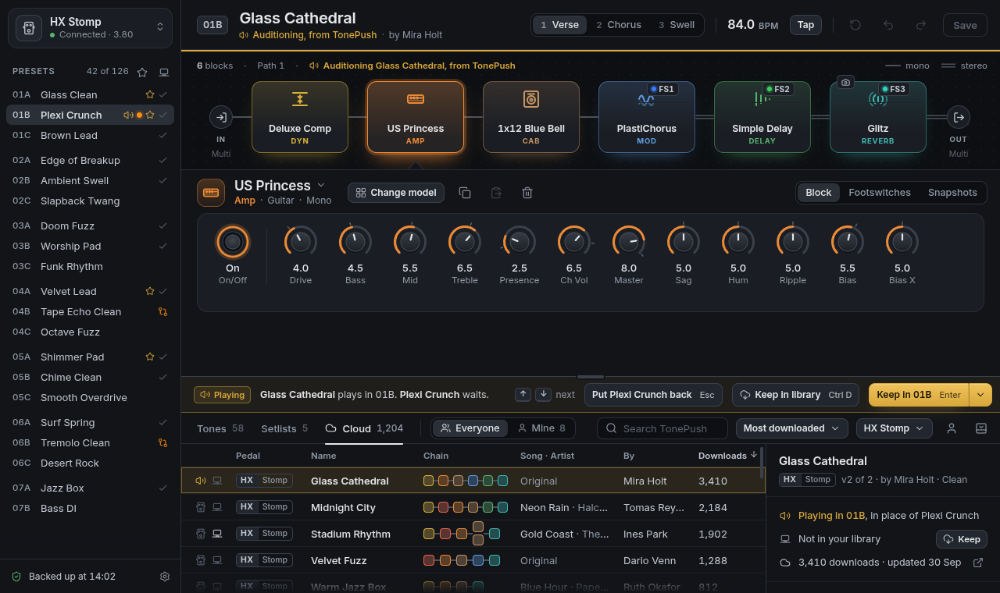

Cloud, Everyone, scoped to the HX Stomp. The click fetches the file (kept for
the session, checked against its hash as today) and plays it; the bar says
"Loading" until it does. Keep in 01B is still Enter; **Keep in library**
(Ctrl D) keeps the tone without touching the pedal. A TonePush tone kept on
the pedal also goes into the library, so the pedal never holds a tone the
library does not know. The inspector lists the tone's versions; clicking an
older one plays it.

### 05 · A tone for another pedal

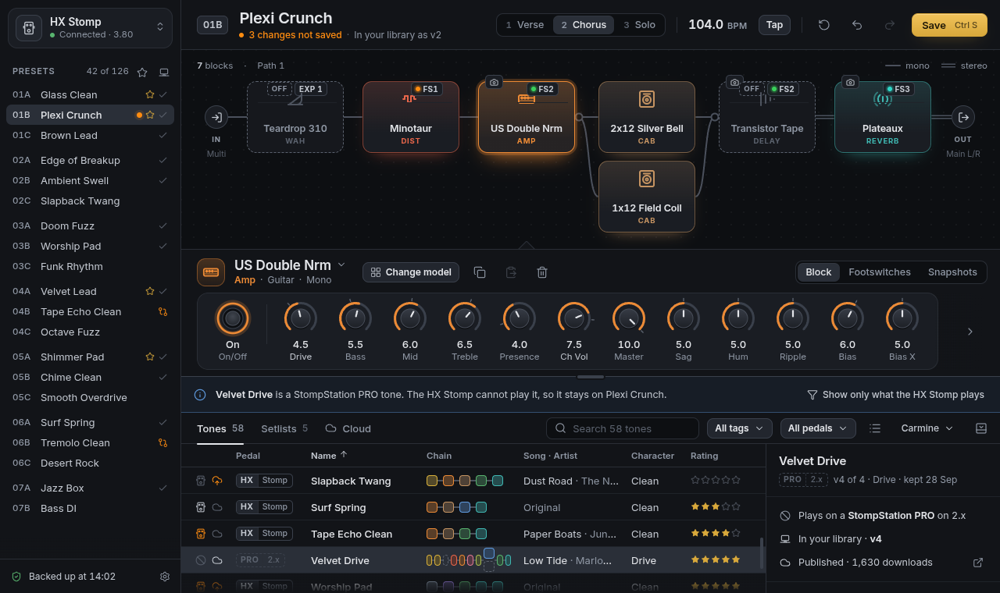

Velvet Drive is a StompStation PRO tone. The click selects it and the strip
where the audition bar would be says why nothing changed: "Velvet Drive is a
StompStation PRO tone. The HX Stomp cannot play it, so it stays on Plexi
Crunch." It offers "Show only what the HX Stomp plays". Not an error, not a
dialog: the same place every click reports to. The other reasons use the same
strip:

- "Pedalboard Wash is an HX Effects tone. The HX Stomp cannot play it."
- "Made on firmware 3.80; this HX Stomp has 3.70." (TonePush lists each
  tone's minimum firmware; the library records the firmware a tone was kept
  on.)
- "Shimmer Lead needs firmware 2.x; this StompStation PRO is on 1.5.12." A
  1.5 tone plays on 2.x with 2.x's default chain, and the strip says so the
  first time.
- "Hosted by Line 6 CustomTone: TonePush cannot play it from here", with Open.

### 06 · No pedal

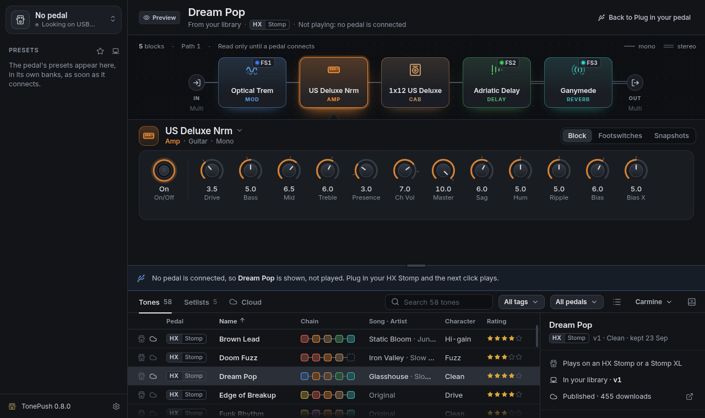

With no pedal, a click shows the tone where the editor would be, read only:
"Preview", its marker, "Not playing: no pedal is connected", its chain and its
blocks' faces. The strip says what would make it play. "Back to Plug in your
pedal" (or Esc) returns to the connect page. A StompStation PRO tone shows its
details only: drawing its chain needs a PRO's schema.

### 07 · A StompStation PRO that cannot save

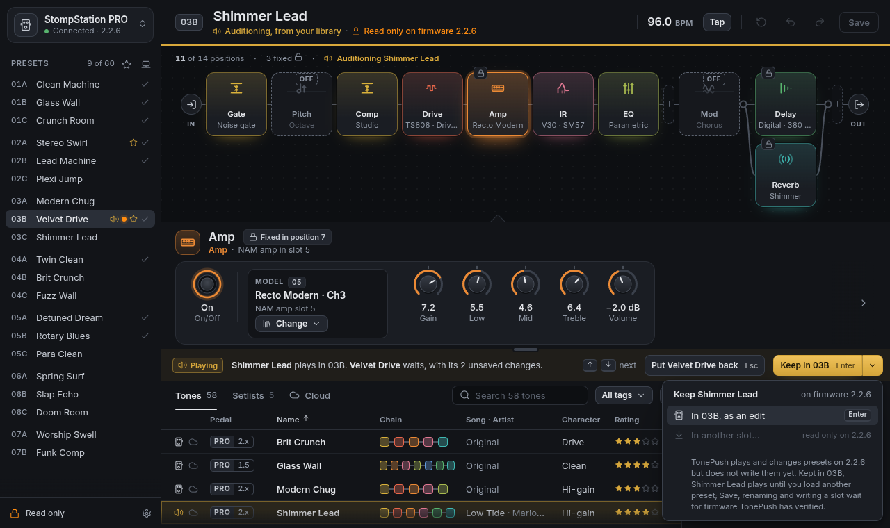

A PRO on 2.2.6, which TonePush plays with but has not verified for saving. A
click still auditions: an audition is live edits, which the pedal takes on any
firmware. Keep in 03B is allowed for the same reason; "In another slot…" says
"read only on 2.2.6", and the note says Save, renaming and writing a slot wait
for verified firmware. On a PRO without a matching backup the same item says
"waits for a backup" and the menu offers "Back up to unlock saving" (17).

### 08 to 14 · Drag and drop

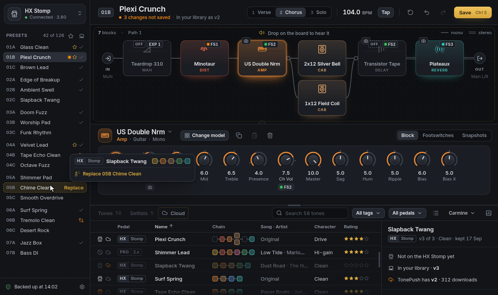

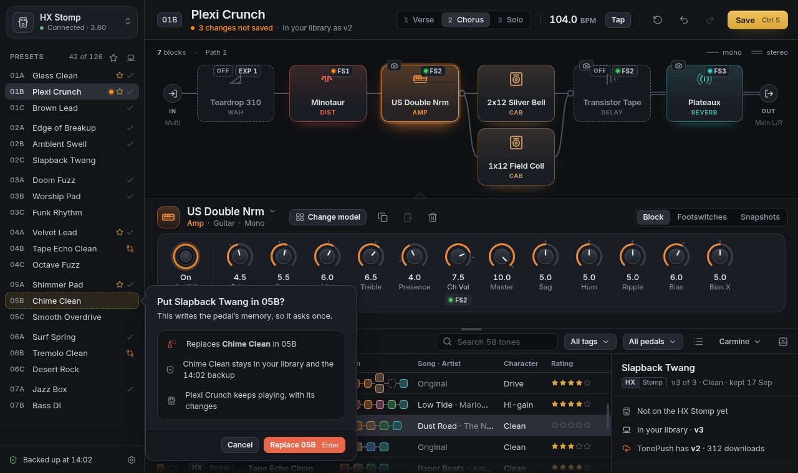

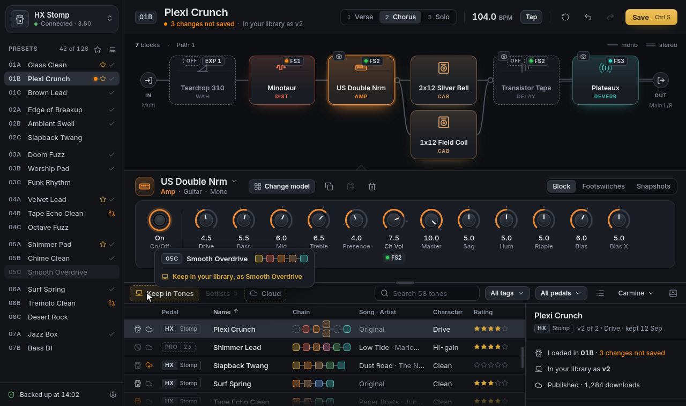

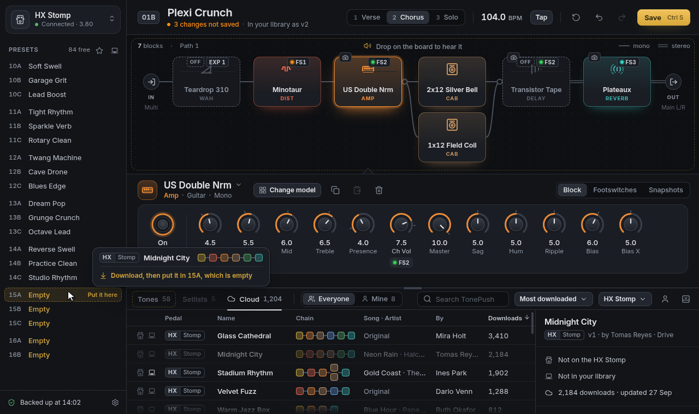

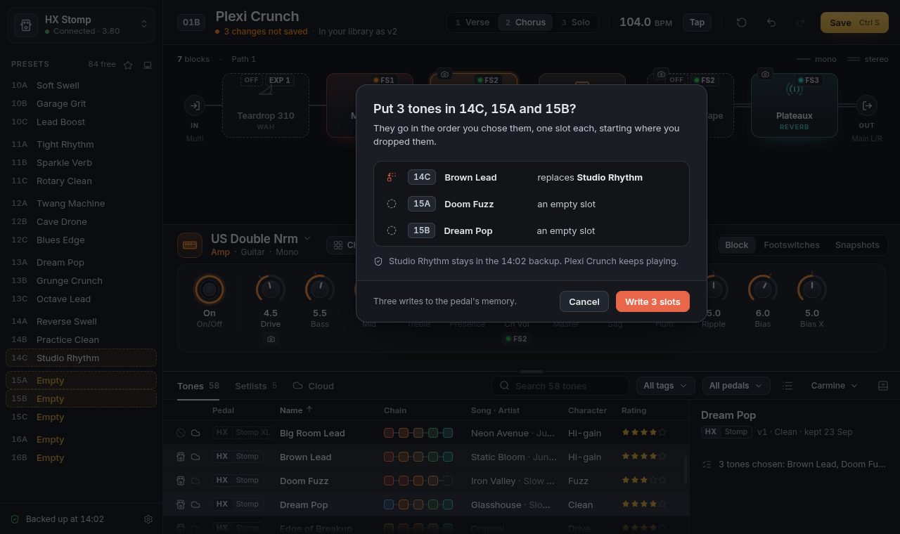

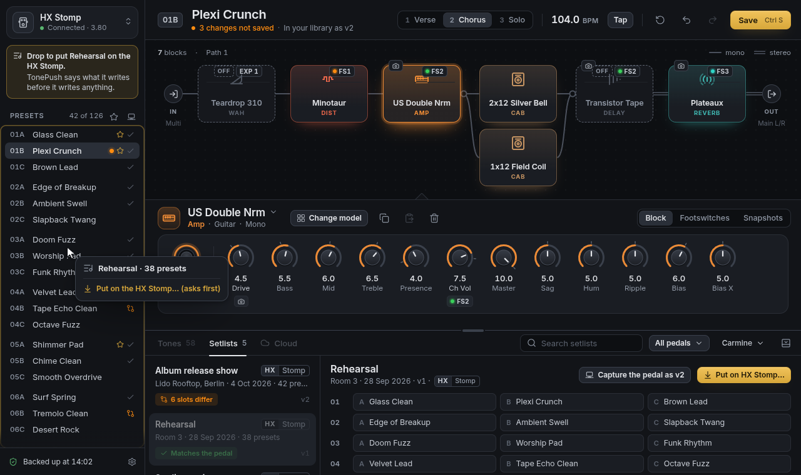

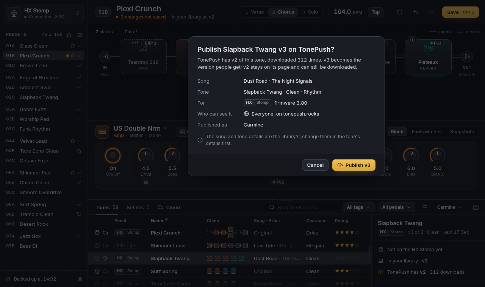

- **08.** Slapback Twang dragged onto 05B. The row under the pointer turns
  into the drop target and says "Replace"; free slots say "Put it here". The
  ghost carries the tone's marker, name and chain, and says the outcome in
  full: "Replace 05B Chime Clean". Other places that would take the drop show
  a faint dashed edge: the board ("Drop on the board to hear it") and the
  Cloud tab (publish). Places that would not are dimmed.
- **09.** The drop asks once, beside the row: "Put Slapback Twang in 05B?",
  what it replaces, that Chime Clean stays in the library and the backup, and
  that Plexi Crunch keeps playing. Replace 05B is the red button (Enter); an
  empty slot gets the amber "Put it in 15A".
- **10.** A preset dragged from the sidebar onto the Tones tab: the tab turns
  into "Keep in Tones". No question unless the name is taken, which asks as
  today (new version or save as).
- **11.** A TonePush tone dragged onto an empty slot. While anything is
  dragged over the presets, free slots read Empty in amber, as sending always
  has, and the Presets heading says "84 free". The drop downloads the tone,
  keeps it in the library, and writes the slot after asking.
- **12.** Three tones dropped on 14C fill 14C, 15A and 15B in the order
  chosen. The question lists every slot: one preset replaced, two empty slots
  filled.
- **13.** A setlist dragged onto the presets: the whole list is the target,
  and the drop opens the question Put on the pedal always asks
  (`setlist-confirm` as built).
- **14.** A library tone dropped on the Cloud tab publishes it. TonePush has
  v2 of Slapback Twang, so the sheet says v3 becomes the version people get
  and v2 stays downloadable, and lists the Song, the tone, the pedal and
  firmware, who can see it, and the account.

### 15 · What goes where

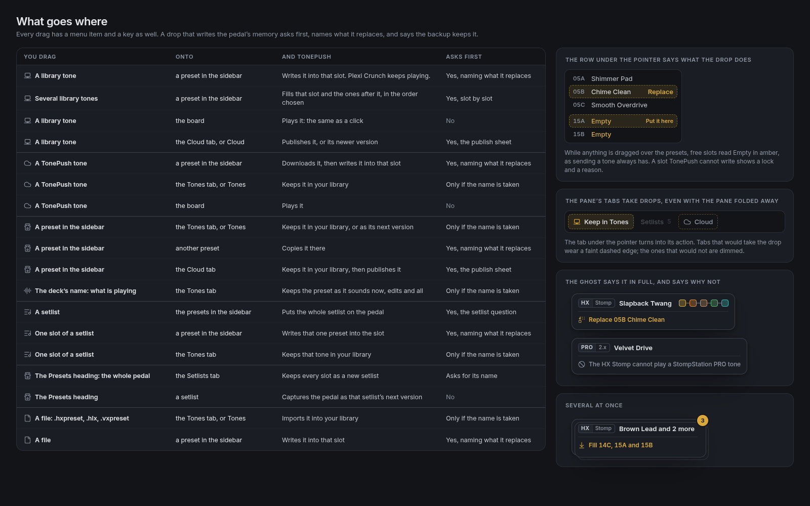

The whole map: what you drag (a library tone or several, a TonePush tone, a
preset, what is playing, a setlist or one of its slots, the whole pedal, a
file), what you drop it on, what happens, and whether it asks first; beside
it, the drop indicators: the row under the pointer, tabs that take drops even
folded, the ghost's outcome and its "why not", and several at once.

### 16 · Device markers

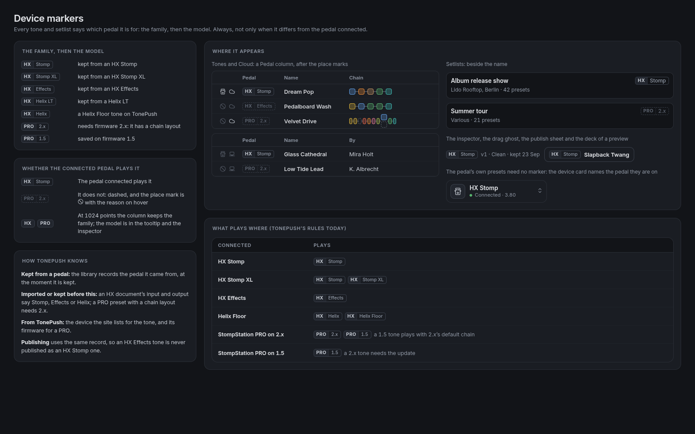

Also [light](16-device-markers-1600x1000-light.png).

A two-part chip: the family (HX or PRO), then the model (Stomp, Stomp XL,
Effects, Helix LT, Helix) or, for a PRO, the firmware its chain needs (2.x
when the preset has a chain layout, 1.5 when it has none). Solid when the
connected pedal plays it; dashed and faint when it does not, with a ban mark
as its place mark and the reason on hover. At 1024 points the column keeps the
family and the model moves to the tooltip and the inspector. It appears in
the same place everywhere: a Pedal column after the place marks in Tones,
Cloud and Mine; beside a setlist's name; in the inspector, the drag ghost,
the publish sheet and a preview's deck. The pedal's own presets carry none:
the device card names the pedal they are on.

The library learns the model three ways: the pedal a tone is kept from is
recorded when it is kept; a tone imported or kept before this is read (an HX
document's input and output blocks say Stomp, Effects or Helix; a PRO preset's
router record says 2.x); a TonePush tone carries the device the site lists.
Publishing uses the same record.

### 17 · Right-click menus

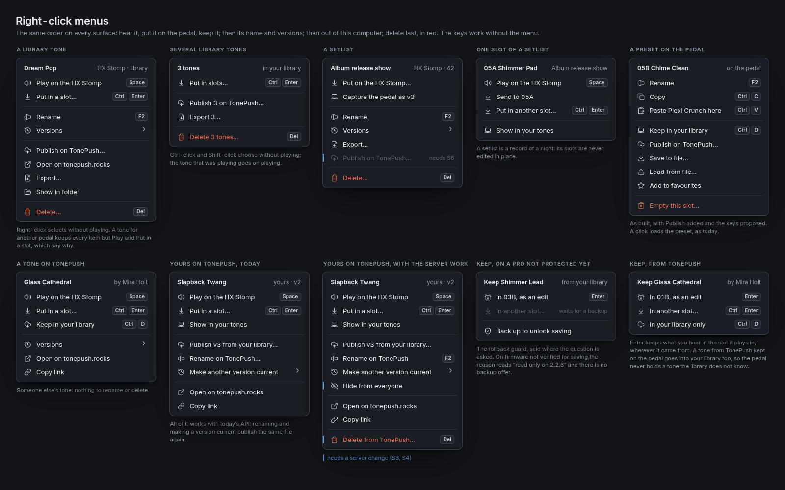

One order on every surface: hear it, put it on the pedal, keep it; then its
name and versions; then out of this computer; delete last, alone, in red. The
same action has the same words, icon and key everywhere. The sheet shows a
library tone, several, a setlist, one slot of a setlist, a preset on the
pedal, a TonePush tone, your upload today and with the server work, and
Keep's choices on an unprotected PRO and from TonePush. An item a tone cannot
use says why on its right rather than disappearing (Play and Put in a slot,
for a tone of another pedal). Items that need server work are marked with a
blue rule in the sheet and are not shown until the server supports them.

### 18 to 20 · What you published

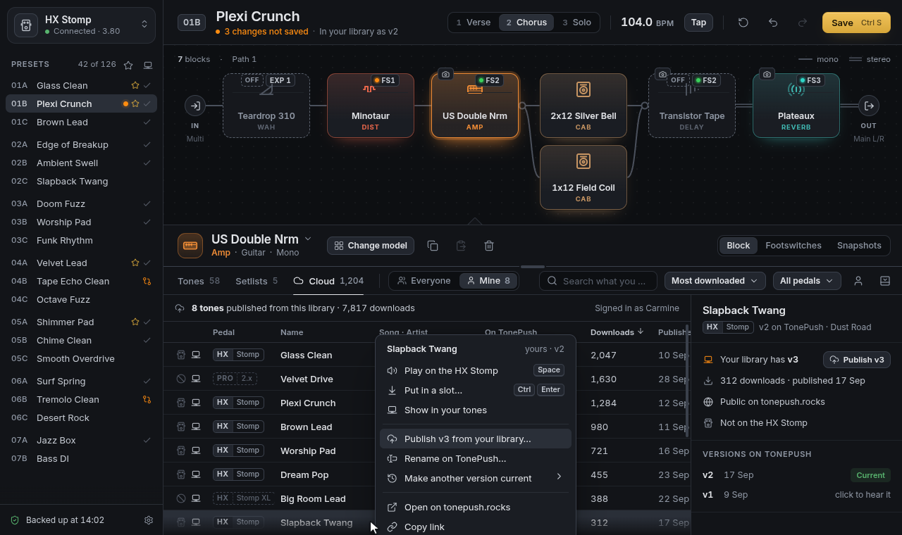

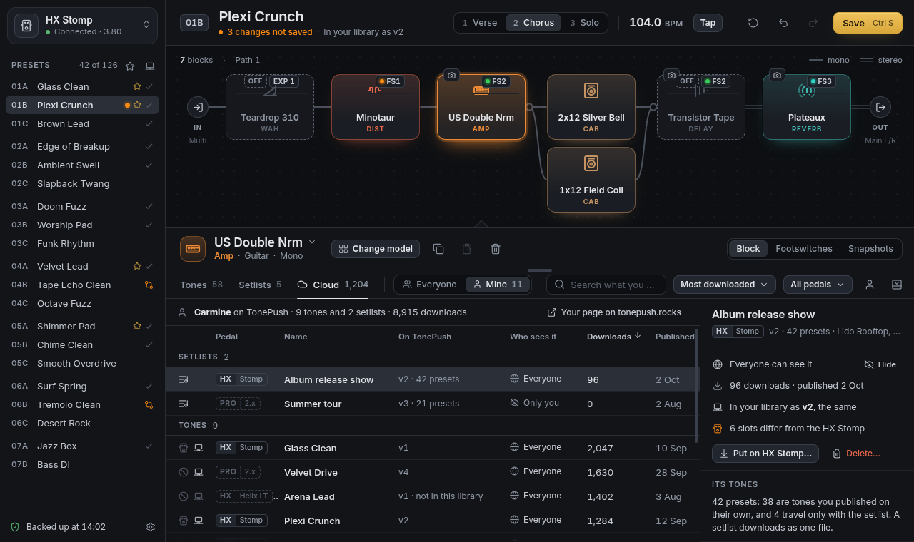

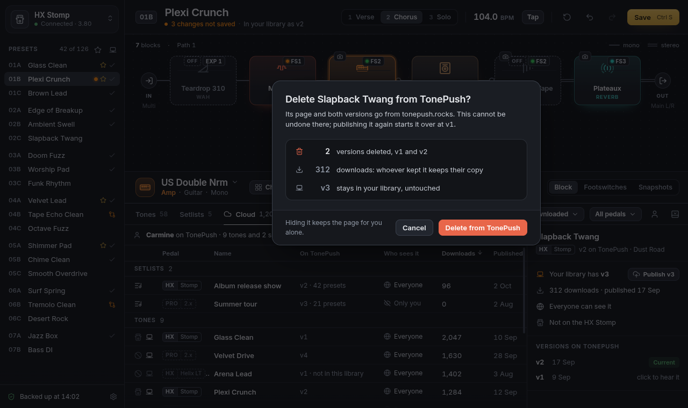

Cloud, **Mine**. The pane has been dragged up to the board, so the block pane
keeps only its head.

- **18, today's API.** "8 tones published from this library · 7,817
  downloads". Each row: the pedal and library marks, the marker, the name, the
  Song, the version on TonePush ("v2 · library has v3" in hot when the library
  is ahead), downloads and the date. Right-clicking Slapback Twang selects it
  without playing and shows what works now: Publish v3 from your library,
  Rename on TonePush, Make another version current, Open, Copy link.
- **19, with the server work (a separate item, see below).** Everything you
  published from any computer, setlists first: "Album release show" with its
  42 presets, who can see it (Everyone, or Only you), downloads, and Put on HX
  Stomp…, Hide and Delete in the inspector; tones published from another
  computer say "not in this library".
- **20.** Deleting asks with the counts: two versions deleted, 312 downloads
  whose copies stay with whoever kept them, v3 untouched in the library, and
  the gentler choice in the footer: hiding keeps the page for you alone.

### 21, 22 · The pedal's own pages

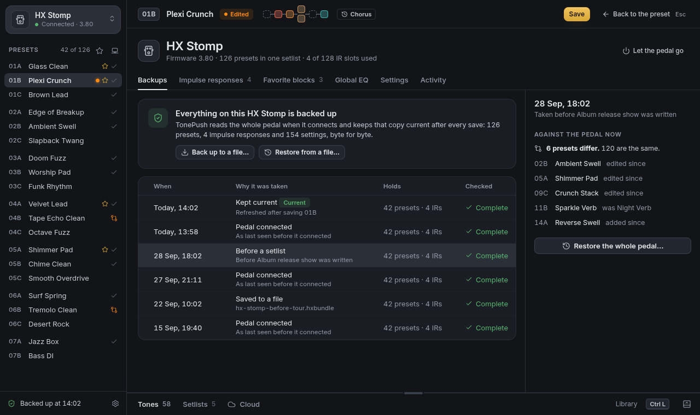

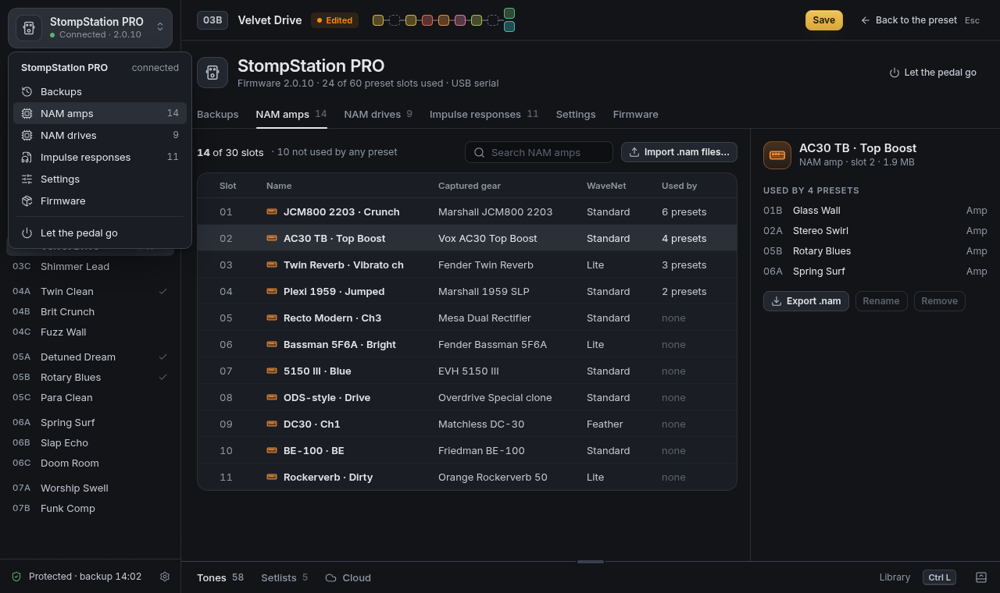

Also [1024 × 640](21-pedal-pages-1024x640-dark.png).

The device card is selected while its pages show. The tabs are in the page's
head, next to what they switch. The library is folded to its tabs at the
bottom, which still take drops, with Ctrl L beside them. On the PRO, the
device card's menu lists its pages: Backups, NAM amps, NAM drives, Impulse
responses, Settings, Firmware, then Let the pedal go.

### 23 · A setlist's slot

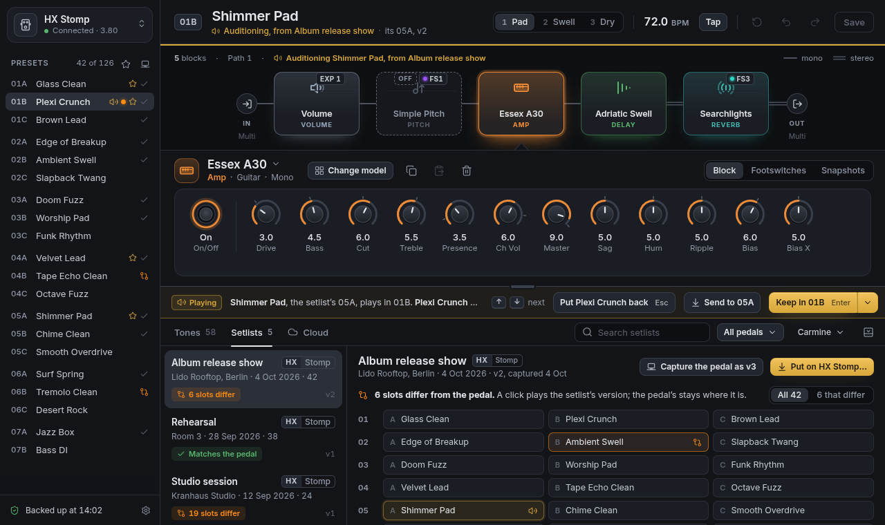

Library, Setlists, Album release show against the pedal. A click on 05A plays
the setlist's Shimmer Pad, which differs from the pedal's; the pedal's own
05A stays where it is. The bar adds **Send to 05A**, which writes the
setlist's version back into its slot after asking. A setlist is still a
record: its slots are never edited in place.

## Flows

**A. Hear a library tone and keep it in the loaded slot**

1. Click Dream Pop. The pedal plays it in 01B; the bar, deck, board and row
   say so. Plexi Crunch and its changes are set aside.
2. Turn its reverb up. The tweak belongs to the audition.
3. Press Enter (Keep in 01B). Dream Pop is 01B's edit, tweak included; the
   deck says "Changes not saved"; Undo would bring Plexi Crunch back with its
   three changes.
4. Press Ctrl S. Dream Pop is written over Plexi Crunch in 01B, as any save.

**B. Step through tones**

1. Click a row, then press ↓ and ↑. Each row you stop on plays; a fast run
   sends only the last one (the worker collapses queued auditions as it
   collapses preset selects today).
2. Space flips between the tone and what you had, to compare them; each flip
   is one preset write, about a second on an HX.
3. Esc puts back. Arrow keys follow the last list you clicked: the library's
   rows, or the pedal's presets as today.

**C. Put a tone in another slot**

1. Keep ▾ › In another slot… (Ctrl Enter), Put in a slot… in the row's menu,
   or drag the row onto a preset.
2. The sidebar's rows say Replace or Put it here; free slots read Empty in
   amber.
3. Choose 05B. The question beside the row names Chime Clean and the backup
   that keeps it.
4. Enter. 05B is written. An audition ends with Plexi Crunch back, changes
   and all; the deck's state line says "Wrote Slapback Twang to 05B".

**D. Put back**

Esc, the bar's button, clicking another preset (which puts back first and
then asks about Plexi Crunch's unsaved changes, as built), or Space on the
playing row. The worker writes the set-aside buffer back byte for byte and
restores its undo history.

**E. Try tones from TonePush and keep one**

1. Cloud, Everyone. Click a tone; the bar says Loading, then Playing.
2. ↓ through the feed. Each tone you stop on is fetched once per session.
3. Ctrl D keeps the one you like in the library; Enter keeps it in 01B (and
   in the library); Esc puts back.

**F. Keep a preset from the pedal**

Drag it from the sidebar onto the Tones tab or the Tones list, or Ctrl D, or
its menu. A name already used by another tone asks as today: new version, or
save as.

**G. Publish**

1. Drag a tone onto the Cloud tab, or Publish on TonePush… in its menu.
2. Not signed in: the sheet signs in first (the pairing code, as built).
3. The sheet names the Song, the tone, the pedal and firmware, who can see it
   and the account; for a published tone, the version it becomes.
4. Publish. A new version goes to the Song the tone already has.

**H. Put a setlist on the pedal**

Drag the setlist onto the presets, or its menu, or its page's button. The
question as built says what it replaces, empties, fills and leaves alone.

**I. Manage what you published, today**

1. Cloud › Mine lists what this library published, with downloads and the
   version on TonePush.
2. "v2 · library has v3": Publish v3 from your library.
3. Rename on TonePush… publishes the same file again with the new name.
4. Make another version current publishes that version's file again; the
   server makes it current without a new version.

**J. With the server work**

Mine lists everything you published from any computer, tones and setlists;
Hide and Show switch who sees it; Delete from TonePush asks with the counts;
Your page opens your profile on tonepush.rocks.

**K. When a click cannot play, or the pedal cannot keep**

Another family or model, newer firmware, a 2.x tone on 1.5, a tone hosted
elsewhere, or no pedal: the strip where the bar goes says why, and the row
stays selected so its details show. On unverified PRO firmware, auditions and
Keep in 03B work and writing a slot says why not. On an unprotected PRO, the
drop's question offers "Back up, then put it in 05B" (about 40 seconds, as
"Back up to unlock saving" is).

## Audition rules

The worker already holds most of this (`session.rs` `Audition`, `pro.rs`
`audition_original`); what changes is marked.

- **What is set aside**: the loaded preset's document, its dirty flag, its
  undo and redo history, once, at the first audition. Moving from tone to
  tone keeps that baseline.
- **Put back** writes it back byte for byte and restores the history.
- **Keep in the loaded slot** makes the audition an ordinary unsaved edit, the
  set-aside preset one Undo step (`KeepAudition`).
- **Put in another slot** ends the audition first (Put back), then writes the
  slot. It never touches the loaded buffer.
- **Edits during an audition** (changed): today any edit ends the audition and
  lands on the restored preset. Proposed: an edit stays in the audition, Put
  back still restores the set-aside preset exactly, Keep keeps what you hear.
  Stepping to the next tone drops those edits, and the bar says so once they
  exist ("Dream Pop, with 2 changes").
- **Save during an audition** (changed): the deck's Save is off and Ctrl S
  points at the bar. Today the worker ends the audition and saves the
  set-aside preset's changes, which is safe but not what was meant.
- **Switching preset** puts back first, then asks about the unsaved changes,
  as built (`unsaved()` counts the set-aside buffer).
- **Switching tabs** no longer ends an audition (changed): the bar stays.
- **The pedal moving by itself** (its footswitches) ends the audition with
  nothing to restore, as built (`adopt`); the deck says what happened.
- **Disconnecting** forgets the audition, as built.

## Keys

Ctrl S, Ctrl Z, Ctrl B, Esc and the arrow keys on the pedal's presets exist
today; the rest are proposed.

| Key | Where | What |
| --- | --- | --- |
| Click | any tone, slot of a setlist, version | play it on the pedal |
| ↑ ↓ | the last list clicked | step and play (library), or load (the pedal's presets, as built) |
| Space | a library, Cloud or Mine row | play, or put back if it is playing |
| Enter | while auditioning | Keep in the loaded slot |
| Ctrl Enter | a row, or while auditioning | Put in a slot… |
| Esc | while auditioning | put back; elsewhere, close what is open |
| Ctrl D | a TonePush tone, a preset | keep in the library |
| F2 | a row | rename |
| Del | a row | delete (asks when it should) |
| Ctrl C, Ctrl V | the pedal's presets | copy, paste a preset |
| Ctrl L | anywhere | fold or open the library |
| Ctrl 1, 2, 3 | anywhere | Tones, Setlists, Cloud |
| Ctrl F | anywhere | search the open tab, opening the library |
| Shift F10, Menu | a row | its right-click menu |
| Ctrl B | anywhere | hide the sidebar, as built |

## TonePush's API: what it does and what needs the server

From `tonepush-web` `config/routes.rb` and `app/controllers/api/v1`. The
editor signs in by pairing and sends the session token as a bearer.

| What the editor needs | API today | So the design |
| --- | --- | --- |
| Browse public tones | `GET /api/v1/tones` (search, device, order, pages) | Cloud, Everyone, as built |
| One tone, its versions, downloads | `GET /api/v1/tones/:id` (published only) | inspector, versions, stats |
| Download a tone or a version | `GET /tones/:id/artifact`, `/tones/:id/versions/:n/artifact` | play, keep (each counts as a download) |
| Which local files are published | `GET /api/v1/tones/files` | the cloud place mark, as built |
| Publish a tone | `POST /api/v1/songs`, `POST /api/v1/songs/:id/tones` | publish sheet |
| A new version | the same `POST` with the tone's `series_id` and new bytes | Publish v3 |
| Make an older version current | the same `POST` with that version's bytes | Make another version current |
| Rename, change details | the same `POST` with the same bytes and new fields | Rename on TonePush |
| List your own tones | none: no "mine", and the pairing returns only a display name | Mine shows what this library published, by tone ids it records when it publishes |
| Hide or show a tone | none: tones are `published`, `draft` or `archived`, set only by the server | needs S4 |
| Delete a tone | none (the website deletes a whole Song, by its creator, in HTML only) | needs S3 |
| Setlists | none | needs S6 |
| Your profile's address | none (the pairing returns a display name) | needs S7 |

**Editor-side, no server change:** record the Tone id and Song id from the
publish answer in the library; for tones published before that, search the
public feed by name and match the file hash (exact) once; publish new
versions to the existing Song (`PublishSong::Existing`), which also stops
re-publishing an Original from creating a new Song each time (finding 8).

### Server changes (a separate item for a tonepush-web session)

- **S1. Your uploads.** `GET /api/v1/me` (id, name, slug, profile address)
  and `GET /api/v1/me/tones`: every tone the signed-in account created, in
  any state, from any computer, with its Song, versions, downloads and state.
- **S2. Edit without uploading.** `PATCH /api/v1/tones/:id` (owner): name,
  description, part, tuning, guitar, pickups; and `PATCH /api/v1/songs/:id`
  for a Song's title, tags and description, which the website can edit and
  the API cannot.
- **S3. Delete.** `DELETE /api/v1/tones/:id` (owner): the tone, its versions
  and files; its Song too when that is the owner's Original with no other
  tones.
- **S4. Who can see it.** `PATCH /api/v1/tones/:id` with `state`: published
  (Everyone) or draft (Only you); the owner can still download a hidden
  tone's files with the bearer token (the artifact routes serve published
  tones only today).
- **S5. Auditions are not downloads.** An artifact request marked as an
  audition (a query parameter or header) does not increment
  `installs_count`; counting it separately is optional. Small, and wanted
  before the Cloud plays on a click.
- **S6. Setlists.** A resource for a setlist: name, venue, date, device and
  ordered slots, each a published tone by id or a file of its own;
  create, list yours, show, download as one file, hide, delete. The largest
  item; Cloud's Setlists group, "Publish on TonePush…" for a setlist and
  putting a TonePush setlist on the pedal wait for it.
- **S7. Your page.** The pairing answer (or S1's `/me`) includes the
  account's slug, for "Your page on tonepush.rocks".

## Building it in egui

- **The pane** is an `egui::Panel::bottom` inside the main column, resizable,
  with the grip painted on its top edge; folding sets its height to the
  header. The editor's layout already chooses the knob size from the pane's
  rect each frame; the one-row and head-only steps are two more thresholds.
- **Drag and drop** uses egui's payloads (`Response::dnd_set_drag_payload`,
  `dnd_hover_payload`, `dnd_release_payload`) with one payload type per
  source: a library hash (or several), a TonePush id, a slot, a setlist's
  path, a setlist's slot, the whole pedal, a file path. The ghost paints on
  the tooltip layer at the pointer; each target asks the payload what it would
  do, which is the same function the menus and keys call, so the three cannot
  drift apart.
- **The drop's question** is the dialog component anchored to the row (an
  `egui::Area` beside it) rather than centred; several slots use the centred
  dialog.
- **Click to audition** reuses `Cmd::AuditionDocument`, `AuditionSteps` and
  the PRO's `Audition`; the worker collapses queued auditions as it collapses
  `SelectPreset`; the download cache is the existing `cloud_artifacts`.
- **The device record** is one field in the library's `Meta` (the pedal's
  name, and the PRO firmware generation), filled at keep time and, for old
  tones, once from the document.

## Implementation order

Each stage leaves the editor working.

1. **Device markers.** The library records the pedal; old tones are read
   once; the Pedal column on Tones and Cloud, always; incompatible rows dashed
   with the reason; publishing uses the record.
2. **The frame.** The page switch goes; the library becomes the bottom pane
   with its tabs, splitter, fold and Ctrl L; the pedal's pages open from the
   device card and the foot; the editor's give-way rules.
3. **Click to audition, library tones.** The bar, the deck and board states,
   the row and sidebar marks, Put back and Keep in the loaded slot, arrow keys
   and Space, the Save guard, auditions that survive tab switches.
4. **Edits during an audition** stay in it (worker change, with tests).
5. **Put in a slot** with the question beside the row, for every source and
   for several; the PRO's guard and read-only reasons; a confirmation where
   `finish_sending` writes silently today.
6. **Click to audition from TonePush, setlist slots and versions**, after S5
   or with the open question below answered; firmware and hosted-elsewhere
   reasons.
7. **Drag and drop**, every pair in the map, reusing stage 5's questions.
8. **Menus and keys**, one builder per surface in the shared order.
9. **Mine, today**: tone and Song ids recorded at publish, backfilled once;
   stats; publish a newer version to the same Song; rename and make current by
   publishing again.
10. **Server work** in tonepush-web: S5, then S1 with S7, S2, S4, S3, then S6.
11. **Mine, with the server**: everything you published, Hide, Delete,
    setlists.

## Decisions

Carmine approved the design on 2026-10-02 and answered the open questions:

1. **Edits during an audition** stay in the audition; Put back drops them.
2. **Enter keeps in the loaded slot** for every source, and a TonePush tone
   kept on the pedal also goes into the library.
3. **Writing an empty slot** does not ask; a write that replaces something
   does.
4. **Downloads and auditions** are both tracked by the server, separately
   (S5): an audition never counts as a download.
5. **The library's default scope** is the connected pedal, with All pedals
   one click away.
6. **A drag between the pedal's presets copies**; a modifier moves.
7. **Setlists can be composed now** by dropping tones into their slots.
8. **A 2.x PRO tone on a 1.5.x pedal** is refused with the reason. Firmware
   compatibility is judged by major and minor version: patch releases (1.5.10
   and 1.5.12) are treated alike.
9. **A setlist on TonePush** is a list of published tones (S6).
10. **Sharing** starts with Everyone and Only you; "anyone with the link"
    comes later, and the server's model leaves room for it.

The server items S1 to S7 and the Song-per-version fix went to the
tonepush-web session on 2026-10-02.

## Rendering

`source/render.mjs` renders every scene with `playwright-core` and the system
Chromium (`/usr/bin/chromium`) at device scale 1, with ANGLE on EGL so the
capture runs on the GPU. The run reported `ANGLE (NVIDIA Corporation, NVIDIA
GeForce RTX 3090/PCIe/SSE2, OpenGL ES 3.2)`. It ran under `gpu-lock`:

```sh
NODE_PATH=/path/to/node_modules gpu-lock node source/render.mjs        # every scene
NODE_PATH=/path/to/node_modules gpu-lock node source/render.mjs 01 08  # some
```

`playwright-core` is not a dependency of this repository; install it outside
the tree and point `NODE_PATH` at it. Some scenes are states of one page, set
by a query string: `?menu=keep` on 02, `?case=` on 05 and 08,
`?server=1&dialog=delete` on 18, `?pro=1` on 21, and `?theme=light` on any.
`source/assets/icons-extra.js` takes three icons from fastframe-icons' copy
of Lucide and six from Lucide itself (ISC).
